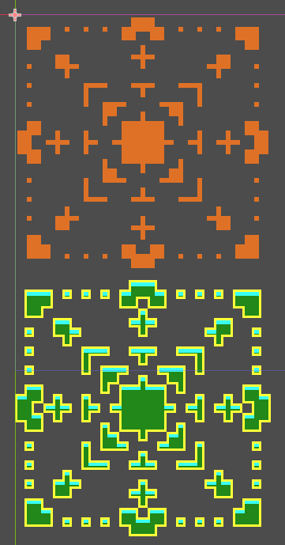

# Godot Autotile Tester

Tests your autotiles for completeness by using it in a tilemap pattern which uses all tiles in the autotile. Currently works with 3x3 (minimal) autotiles.

## Usage
Copy the addons/ folder to your project and enable the plugin in Project Settings. Once done, select your TileSet resource and click on the Test Autotiles button in the Inspector

## License
Code is under the MIT license. [This example image](example/autotile_template_3x3_minimal_topdown_floor.png) was taken from the [Godot Documentation](https://docs.godotengine.org/en/stable/tutorials/2d/using_tilemaps.html) Copyright "Juan Linietsky, Ariel Manzur and the Godot community" under the Creative Commons Attribution 3.0 Unported license (CC BY 3.0).